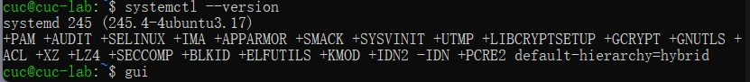

# Chap0x03

## 实验目的

- 了解开机自启动项管理Systemd的基本命令和实战操作
- 通过实际操作进一步了解用户组及权限管理相关知识
- 通过实际操作进一步了解文件系统与存储管理相关知识

## 实验环境

Ubuntu 20.04.02 Server 64bit

## 实验要求

- [Systemd 入门教程：命令篇 by 阮一峰的网络日志](http://www.ruanyifeng.com/blog/2016/03/systemd-tutorial-commands.html)
- [Systemd 入门教程：实战篇 by 阮一峰的网络日志](http://www.ruanyifeng.com/blog/2016/03/systemd-tutorial-part-two.html)
  - 参照第2章作业的要求，完整实验操作过程通过[asciinema](https://asciinema.org/)进行录像并上传，文档通过github上传

## 实验过程

### 一 命令篇

根据[Systemd 入门教程：命令篇 by 阮一峰的网络日志](http://www.ruanyifeng.com/blog/2016/03/systemd-tutorial-commands.html)完成相关Systemd基本操作

#### 1. 查看Systemd的版本

```shell
systemctl --version
```



#### 2. 系统管理

##### 2.1 systemctl

`systemctl`是Systemd的主命令，用于管理系统：

```shell
# 重启系统
$ sudo systemctl reboot

# 关闭系统，切断电源
$ sudo systemctl poweroff

# CPU停止工作
$ sudo systemctl halt

# 暂停系统
$ sudo systemctl suspend

# 让系统进入冬眠状态
$ sudo systemctl hibernate

# 让系统进入交互式休眠状态
$ sudo systemctl hybrid-sleep

# 启动进入救援状态（单用户状态）
$ sudo systemctl rescue
```

##### 2.2 systemd-analyze

`systemd-analyze`，用于查看启动耗时:

```shell
# 查看启动耗时
$ systemd-analyze                                                                                       
# 查看每个服务的启动耗时
$ systemd-analyze blame

# 显示瀑布状的启动过程流
$ systemd-analyze critical-chain

# 显示指定服务的启动流
$ systemd-analyze critical-chain atd.service
```

[](https://asciinema.org/a/rNZ8KnrQZdnXu3TI2FRqnfh4f)

##### 2.3 hostnamectl

`hostnamectl`，用于查看当前主机的信息:

```shell
# 显示当前主机的信息
$ hostnamectl

# 设置主机名。
$ sudo hostnamectl set-hostname gui
```

[](https://asciinema.org/a/6TFvVZDt0yzfVH4kVROAQBSOC)

##### 2.4 localectl

`localectl`，用于查看本地化设置:

```shell
# 查看本地化设置
$ localectl

# 设置本地化参数。
$ sudo localectl set-locale LANG=en_GB.utf8
$ sudo localectl set-keymap en_GB
```

[](https://asciinema.org/a/uIxqy9dAO123fP0AhbNNfLcIl)

##### 2.5 timedatectl

用于查看当前时区设置：

```shell
# 查看当前时区设置
$ timedatectl

# 显示所有可用的时区
$ timedatectl list-timezones                                                                                   
# 设置当前时区
$ sudo timedatectl set-timezone America/New_York
$ sudo timedatectl set-time YYYY-MM-DD
$ sudo timedatectl set-time HH:MM:SS
```

##### 2.6 loginctl

用于查看当前登录的用户:

```shell
# 列出当前session
$ loginctl list-sessions

# 列出当前登录用户
$ loginctl list-users

# 列出显示指定用户的信息
$ loginctl show-user ruanyf #<user>
```

[](https://asciinema.org/a/54cBTgR5AqYz8D2nL1x0gwU39)

#### 4. Unit

##### 4.1 list-units

查看当前系统的所有Unit

```shell
# 列出正在运行的 Unit
$ systemctl list-units

# 列出所有Unit，包括没有找到配置文件的或者启动失败的
$ systemctl list-units --all

# 列出所有没有运行的 Unit
$ systemctl list-units --all --state=inactive

# 列出所有加载失败的 Unit
$ systemctl list-units --failed

# 列出所有正在运行的、类型为 service 的 Unit
$ systemctl list-units --type=service
```

[](https://asciinema.org/a/rHtwhslecPgShHz44SRRmiOoT)

##### 4.2 status

 查看系统状态和单个Unit的状态：

```shell
# 显示系统状态
$ systemctl status

#以下unit选accounts-daemon.service为例
# 显示某个 Unit 是否正在运行
$ systemctl is-active accounts-daemon.service

# 显示某个 Unit 是否处于启动失败状态
$ systemctl is-failed accounts-daemon.service

# 显示某个 Unit 服务是否建立了启动链接
$ systemctl is-enabled accounts-daemon.service
```

[](https://asciinema.org/a/147yGdsAYKPC6SxZAeRS9PQxt)

##### 4.3 list-dependencies

 列出一个Unit的所有依赖：

```shell
$ systemctl list-dependencies nginx.service
#展开 Target
$ systemctl list-dependencies --all nginx.service
```

##### 4.4 list-unit-files

列出所有配置文件

```shell
# 列出所有配置文件
$ systemctl list-unit-files

# 列出指定类型的配置文件
$ systemctl list-unit-files --type=service
```

#### 5. target管理

```shell
# 查看当前系统的所有 Target
$ systemctl list-unit-files --type=target

# 查看一个 Target 包含的所有 Unit
$ systemctl list-dependencies multi-user.target

# 查看启动时的默认 Target
$ systemctl get-default

# 设置启动时的默认 Target
$ sudo systemctl set-default multi-user.target

# 切换 Target 时，默认不关闭前一个 Target 启动的进程，
# systemctl isolate 命令改变这种行为，
# 关闭前一个 Target 里面所有不属于后一个 Target 的进程
$ sudo systemctl isolate multi-user.target
```

[](https://asciinema.org/a/mjF9G6CmYBOsHYqn0iSI29vYc)

#### 6. 日志管理

```shell
#查看所有日志（默认情况下 ，只保存本次启动的日志）
$ sudo journalctl

# 查看内核日志（不显示应用日志）
$ sudo journalctl -k

# 查看系统本次启动的日志
$ sudo journalctl -b
$ sudo journalctl -b -0

# 查看上一次启动的日志（需更改设置）
$ sudo journalctl -b -1

# 查看指定时间的日志
$ sudo journalctl --since="2012-10-30 18:17:16"
$ sudo journalctl --since "20 min ago"
$ sudo journalctl --since yesterday
$ sudo journalctl --since "2015-01-10" --until "2015-01-11 03:00"
$ sudo journalctl --since 09:00 --until "1 hour ago"

# 显示尾部的最新10行日志
$ sudo journalctl -n

# 显示尾部指定行数的日志
$ sudo journalctl -n 20

# 实时滚动显示最新日志
$ sudo journalctl -f

# 查看指定服务的日志
$ sudo journalctl /usr/lib/systemd/systemd

# 查看指定进程的日志
$ sudo journalctl _PID=1

# 查看某个路径的脚本的日志
$ sudo journalctl /usr/bin/bash

# 查看指定用户的日志
$ sudo journalctl _UID=33 --since today

# 查看某个 Unit 的日志
$ sudo journalctl -u nginx.service
$ sudo journalctl -u nginx.service --since today

# 实时滚动显示某个 Unit 的最新日志
$ sudo journalctl -u nginx.service -f

# 合并显示多个 Unit 的日志
$ journalctl -u nginx.service -u php-fpm.service --since today

# 查看指定优先级（及其以上级别）的日志，共有8级
# 0: emerg
# 1: alert
# 2: crit
# 3: err
# 4: warning
# 5: notice
# 6: info
# 7: debug
$ sudo journalctl -p err -b

# 日志默认分页输出，--no-pager 改为正常的标准输出
$ sudo journalctl --no-pager

# 以 JSON 格式（单行）输出
$ sudo journalctl -b -u nginx.service -o json

# 以 JSON 格式（多行）输出，可读性更好
$ sudo journalctl -b -u nginx.service -o json-pretty

# 显示日志占据的硬盘空间
$ sudo journalctl --disk-usage

# 指定日志文件占据的最大空间
$ sudo journalctl --vacuum-size=1G

# 指定日志文件保存多久
$ sudo journalctl --vacuum-time=1years
```


### 二 实战篇

根据[Systemd 入门教程：实战篇 by 阮一峰的网络日志](http://www.ruanyifeng.com/blog/2016/03/systemd-tutorial-part-two.html)完成相关Systemd基本操作

```shell
#软件开机自启动
sudo systemctl enable apache2

#启动服务
sudo systemctl start apache2

#查看运行状态
sudo systemctl status apache2

#停止服务
sudo systemctl stop apache2.service

#重启服务
sudo systemctl restart httpd.service

#读配置文件
systemctl cat sshd.service

# 查看 multi-user.target 包含的所有服务
$ systemctl list-dependencies multi-user.target
```


### 三 自查清单

##### 1. 如何添加一个用户并使其具备sudo执行程序的权限？

```shell
cat /ect/group #查看用户组
sudo adduser gui #添加用户
sudo adddroup mygroup #添加用户组
sudo usermod -G sudo -a gui #将该用户添加到sudo组中
sudo groupdel <groupname>  #删除用户组
```


##### 2. 如何将一个用户添加到一个用户组？

```shell
usermod -a -G <groupname> <username>
```

##### 3. 如何查看当前系统的分区表和文件系统详细信息？

```shell
sudo fdisk -l 	#查看分区表
#-l ：输出后面接的装置所有的分区内容。若仅有 fdisk -l 时系统将会把整个系统内能够搜寻到的装置的分区均列出来。

df -h 	
#df 示目前在 Linux 系统上的文件系统磁盘使用情况统计
#-h --human-readable 以人们较易阅读的 GBytes, MBytes, KBytes 等格式自行显示
```


##### 4. 如何实现开机自动挂载 Virtualbox 的共享目录分区？


##### 5. 基于LVM（逻辑分卷管理）的分区如何实现动态扩容和缩减容量？

```shell
lvextend -L +<容量> <目录>    #扩容
lvreduce -L -<容量> <目录>    #减容
```


##### 6. 如何通过 systemd 设置实现在网络连通时运行一个指定脚本，在网络断开时运行另一个脚本？

```shell
cd /etc/systemd/system
systemctl cat systemd-networkd.service
sudo systemctl stop systemd-networkd.service
systemctl daemon-reload
sudo systemctl start systemd-networkd.service
```


##### 7. 如何通过 systemd 设置实现一个脚本在任何情况下被杀死之后会立即重新启动？实现***杀不死\***？

- 修改配置文件`[service]`区块，将**`restart`**设置为**`always`**

- ```shell
  [Service]
  Restart = always
  ```

- 然后重新加载配置文件`sudo systemctl daemon-reload`

- 重新启动服务`sudo systemctl restart ××××`


## 参考

- [Systemd 入门教程：命令篇](http://www.ruanyifeng.com/blog/2016/03/systemd-tutorial-commands.html)
- [Systemd 入门教程：实战篇](http://www.ruanyifeng.com/blog/2016/03/systemd-tutorial-part-two.html)