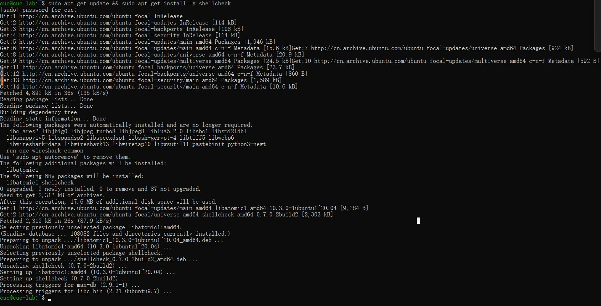
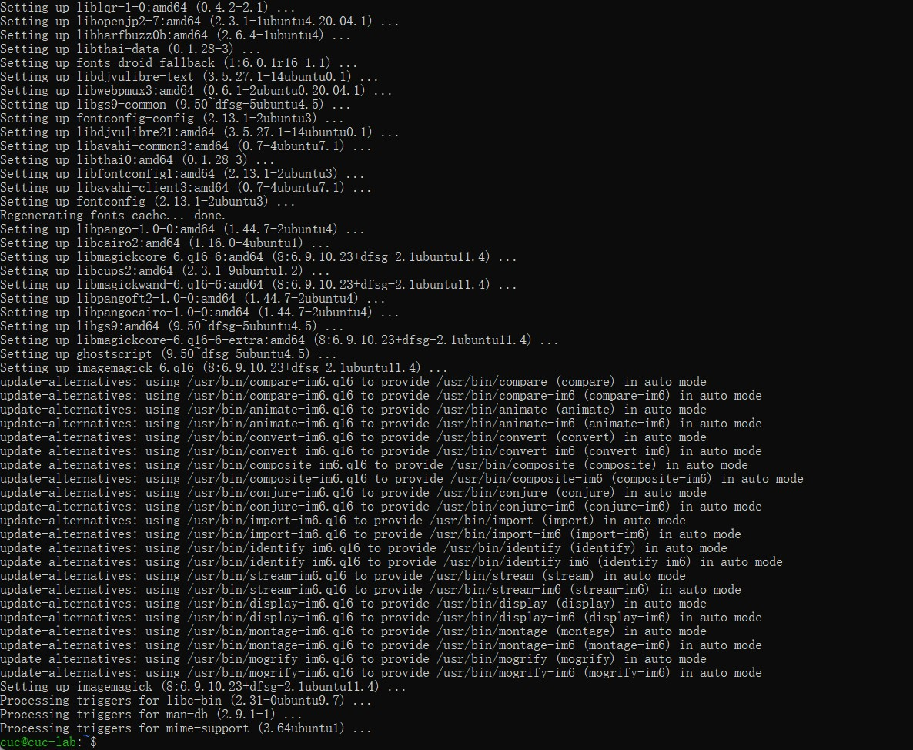

# Chap0x04

第四章：shell脚本编程基础（实验）

> Don’t repeat yourself

## 实验环境

Ubuntu 20.04.02 Server 64bit

## 实验报告要求

- 继承[第一章：Linux基础（实验）](https://c4pr1c3.github.io/LinuxSysAdmin/chap0x01.exp.md.html)的所有实验报告要求
- 上述任务的所有源代码文件必须单独提交并提供详细的**–help**脚本内置帮助信息
- 任务二的所有统计数据结果要求写入独立实验报告

## 实验过程

### 任务一

- 用bash编写一个图片批处理脚本，实现以下功能：
  - 支持命令行参数方式使用不同功能
  - 支持对指定目录下所有支持格式的图片文件进行批处理
  - 支持以下常见图片批处理功能的单独使用或组合使用
    - 支持对jpeg格式图片进行图片质量压缩
    - 支持对jpeg/png/svg格式图片在保持原始宽高比的前提下压缩分辨率
    - 支持对图片批量添加自定义文本水印
    - 支持批量重命名（统一添加文件名前缀或后缀，不影响原始文件扩展名）
    - 支持将png/svg图片统一转换为jpg格式图片

- 安装`shellcheck`

  ```shell
  sudo apt-get update && sudo apt-get install -y shellcheck
  ```

  

- 安装`imagemagick`

  ```shell
  sudo apt-get install -y imagemagick
  ```

  

- 将测试图片导入到虚拟机的test_shell文件夹里面

- 根据任务一的内容编写脚本并进行`shellcheck`：

  ```shell
  #!/usr/bin/env bash
  
  function help {
      echo "========图片处理脚本的帮助文档========"
      echo "
      脚本支持：
      1.命令行参数方式使用不同功能
      2.对指定目录下所有支持格式的图片文件进行批处理指定目录进行批处理
      3.以下常见图片批处理功能的单独使用或组合使用
          ①对jpeg格式图片进行图片质量压缩
          ②对jpeg/png/svg格式图片在保持原始宽高比的前提下压缩分辨率
          ③对图片批量添加自定义文本水印
          ④批量重命名（统一添加文件名前缀或后缀，不影响原始文件扩展名）
          ⑥将png/svg图片统一转换为jpg格式；
      -q Q               对jpeg格式图片进行图片质量因子为Q的压缩
      -d D               对jpeg/png/svg格式图片在保持原始宽高比的前提下压缩成D分辨率
      -w fontsize watermark_text  对图片批量添加自定义文本水印
      -p text            批量重命名，统一添加文件名前缀，不影响原始文件扩展名
      -s text            批量重命名，统一添加文件名后缀，不影响原始文件扩展名
      -t                 将png/svg图片统一转换为jpg格式图片
      -h                 显示本脚本的帮助文档"
  }
  
  
  #①支持对jpeg格式图片进行图片质量压缩
  #convert filename1 -quality 50 filename2
  function Picture_quality_compression(){
      Q=$1 # 质量因子
      for i in *;do
          type=${i##*.} # 获取文件类型 （删除最后一个.及左边的全部字符）
          if [[  ${type} != "jpeg" ]]; then continue; fi;
          convert "${i}" -quality "${Q}" "${i}"
          echo "Compressing ${i} -- down."
      done
      echo "========图片质量压缩完成========"
  }
  
  #②支持对jpeg/png/svg格式图片在保持原始宽高比的前提下压缩分辨率
  #convert filename1 -resize 50% filename2
  function Compression_resolution(){
      D=$1
      for i in *;do
          type=${i##*.}
          if [[ ${type} != "jpg" && ${type} != "jpeg" && ${type} != "png" && ${type} != "svg" ]]; then continue; fi;
          convert "${i}" -resize "${D}" "${i}"
          echo "Proportional compressing ${i} is complete."
      done
      echo "=========分辨率压缩完成========="
  }
  
  #③支持对图片批量添加自定义文本水印
  # convert filename1 -pointsize 50 -fill black -gravity center -draw "text 10,10 'Works like magick' " filename2
  function add_watermarking(){
      for i in *;do
          type=${i##*.}
          if [[ ${type} != "jpg" && ${type} != "jpeg" && ${type} != "png" && ${type} != "svg" ]]; then continue; fi;
          convert "${i}" -pointsize "$1"  -draw "text 0,20 '$2'" "${i}"
          echo "Watermarking ${i} with $2 is complete."
      done
      echo "==========添加水印完成=========="
      return
  }
  
  #④支持批量重命名（统一添加文件名前缀或后缀，不影响原始文件扩展名）
  #1.批量重命名，统一添加文件名前缀，不影响原始文件扩展名
  # mv filename1 filename2
  function add_prefix(){
      for i in *;do
          type=${i##*.}
          if [[ ${type} != "jpg" && ${type} != "jpeg" && ${type} != "png" && ${type} != "svg" ]]; then continue; fi;
          mv "${i}" "$1""${i}"
          echo "${i} is prefixed as $1${i} "
      done
      echo "=========批量重命名加前缀完成=========="
  }
  
  #2.批量重命名，统一添加文件名后缀，不影响原始文件扩展名
  # mv filename1 filename2
  function add_suffix(){
      for i in *;do
          type=${i##*.}
          if [[ ${type} != "jpg" && ${type} != "jpeg" && ${type} != "png" && ${type} != "svg" ]]; then continue; fi;
          newname=${i%.*}$1"."${type}
          mv "${i}" "${newname}"
          echo "${i} is suffixed as ${newname} "
      done
      echo "=========批量重命名加后缀完成=========="
  
  }
  
  #支持将png/svg图片统一转换为jpg格式图片
  # convert xxx.png xxx.jpg
  function trans_jpg(){
      for i in *;do
          type=${i##*.}
          if [[ ${type} != "png" && ${type} != "svg" ]]; then continue; fi;
          newfile=${i%.*}".jpg"
          convert "${i}" "${newfile}"
     	echo "Transform ${i} to ${newfile}is complete."
      done
      echo "==========转换格式完成=========="
  }
  
  # 以下实现命令行参数方式使用不同功能
  while true;do
  case "$1" in
      "-q")
          Picture_quality_compression "$2"
          exit 0
          ;;
      "-d")
          Compression_resolution "$2"
          exit 0
          ;;
      "-w")
          add_watermarking "$2" "$3"
          exit 0
          ;;
      "-p")
          add_prefix "$2"
          exit 0
          ;;
      "-s")
          add_suffix "$2"
          exit 0
          ;;
      "-t")
          trans_jpg
          exit 0
          ;;
      "-h")
          help
          exit 0
          ;;
  esac
  help
  exit 0
  done
  ```

- 测试执行：

  - 1.直接执行脚本文件不带参数

    ```shell
    bash h4-1.sh
    ```

  - 2.显示本脚本的帮助文档

    ````shell
    bash h4-1.sh -h
    ````

  - 3.对jpeg格式图片进行图片质量因子为Q的压缩

    ````shell
    identify test5.jpeg  #查看图片信息
    bash h4-1.sh -q 50
    identify test5.jpeg  #查看图片压缩后的信息
    ````

  - 4.对jpeg/png/svg格式图片在保持原始宽高比的前提下压缩成D分辨率

    ```shell
    #查看压缩前图片详细信息
    identify test1.jpg test2.png test3.JPG test4.svg test5.jpeg	
    #执行
    bash h4-1.sh -d 90
    #再查看详细信息
    identify test1.jpg test2.png test3.JPG test4.svg test5.jpeg
    ```

  - 5.对图片批量添加自定义文本水印

    ```shell
    bash h4-1.sh -w 5 gui #对文件加字体大小为5的gui数字水印
    ```

  - 6.批量重命名，统一添加文件名前缀，不影响原始文件扩展名

    ```shell
    bash h4-1.sh -p GUI  #文件名前加GUI
    ```

  - 7.批量重命名，统一添加文件名后缀，不影响原始文件扩展名

    ```shell
    bash h4-1.sh -s CUC  #文件名后加CUC
    ```

  - 8.将png/svg图片统一转换为jpg格式图片

    ```shell
    bash h4-1.sh -t
    ```

    

### 任务二

- 用bash编写一个文本批处理脚本，对以下附件分别进行批量处理完成相应的数据统计任务：

  - 2014世界杯运动员数据
    - 统计不同年龄区间范围（20岁以下、[20-30]、30岁以上）的球员**数量**、**百分比**
    - 统计不同场上位置的球员**数量**、**百分比**
    - 名字最长的球员是谁？名字最短的球员是谁？
    - 年龄最大的球员是谁？年龄最小的球员是谁？

  - Web服务器访问日志
    - 统计访问来源主机TOP 100和分别对应出现的总次数
    - 统计访问来源主机TOP 100 IP和分别对应出现的总次数
    - 统计最频繁被访问的URL TOP 100
    - 统计不同响应状态码的出现次数和对应百分比
    - 分别统计不同4XX状态码对应的TOP 10 URL和对应出现的总次数
    - 给定URL输出TOP 100访问来源主机

- 将worldcupplayerinfo.tsv文件导入到虚拟机中

#### 2014世界杯运动员数据

- 根据任务二编写脚本文件h4-2.sh并进行shellcheck:

  ```shell
  #!/usr/bin/env bash
  
  #用bash编写一个文本批处理脚本，对以下附件分别进行批量处理完成相应的数据统计任务：
  #- 2014世界杯运动员数据
    #- 统计不同年龄区间范围（20岁以下、[20-30]、30岁以上）的球员**数量**、**百分比**
    #- 统计不同场上位置的球员数量、百分比
    #- 名字最长的球员是谁？名字最短的球员是谁？
    #- 年龄最大的球员是谁？年龄最小的球员是谁？
  
  file="worldcupplayerinfo.tsv"
  
  function help {
      echo "-c                 统计不同年龄区间范围（20岁以下、[20-30]、30岁以上）的球员数量、百分比"
      echo "-n                 统计不同场上位置的球员数量、百分比"
      echo "-l                 名字最长的球员是谁？名字最短的球员是谁？"
      echo "-a                 年龄最大的球员是谁？年龄最小的球员是谁？"
      echo "-h                 显示本脚本的帮助文档"
  }
  
  # 1.统计不同年龄区间范围（20岁以下、[20-30]、30岁以上）的球员数量、百分比
  function count_age() {
      awk -F "\t" 'BEGIN {a=0; b=0; c=0;}
          $6!="Age" {
              if($6>=0&&$6<20) {a++;}
              else if($6>=20&&$6<=30) {b++;}
              else {c++;}
          }
          END {
              sum=a+b+c;
              printf("Age\tCount\tPercentage\n");
              printf("<20\t%d\t%f%%\n",a,a*100.0/sum);
              printf("[20,30]\t%d\t%f%%\n",b,b*100.0/sum);
              printf(">30\t%d\t%f%%\n",c,c*100.0/sum);
          }'  "$file"
  }
  
  # 2.统计不同场上位置的球员数量、百分比
  function count_num() {
      awk -F "\t" '
          BEGIN {sum=0}
          $5!="Position" {
              pos[$5]++;
              sum++;
          }
          END {
              printf("    Position\tCount\tPercentage\n");
              for(i in pos) {
                  printf("amount of %-15s%5d\t\tproportion: %.3f\n",i,pos[i],pos[i]/sum);
              }
          }'  "$file"
  }
  
  # 3.名字最长的球员是谁？名字最短的球员是谁？
  function  name_length(){
      awk -F "\t" '
          BEGIN {max=-1; min=999;}
          $9!="Player" {
              len=length($9);
              names[$9]=len;
              max=len>max?len:max;
              min=len<min?len:min;
          }
          END {
              for(i in names) {
                  if(names[i]==max) {
                      printf("The longest name is %s.\n", i);
                  } else  if(names[i]==min) {
                      printf("The shortest name is %s.\n", i);
                  }
              }
          }'  "$file"
  }
  
  # 4.年龄最大的球员是谁？年龄最小的球员是谁？(考虑并列)
  function age_extrem() {
      awk -F "\t" '
          BEGIN {max=-1; min=999;}
          $6!="Age"  {
              age=$6;
              names[$9]=age;
              max=age>max?age:max;
              min=age<min?age:min;
          }
          END {
              printf("The oldest age is %d, his name is\t.", max);
              for(i in names) {
                  if(names[i]==max) { printf("%s\n", i); }
              }
              printf("The youngest age is %d, his name is\t.", min);
              for(i in names) {
                  if(names[i]==min) { printf("%s\n", i); }
              }
          }'  "$file"
  }
  
  while true;do
      case "$1" in
          "-c")
              count_age
              exit 0
              ;;
          "-n")
              count_num
              exit 0
              ;;
          "-l")
              name_length
              exit 0
              ;;
          "-a")
              age_extrem
              exit 0
              ;;
          "-h")
              help
              exit 0
              ;;
      esac
      help
      exit 0
  done
  ```

- 测试过程及结果：

  - ```shell
    #执行
    bash h4-2.sh
    #查看帮助文档
    bash h4-2.sh -h
    ```

  - 1.统计不同年龄区间范围（20岁以下、[20-30]、30岁以上）的球员数量、百分比：

    ```shell
    bash h4-2.sh -c
    ```

  - 2.统计不同场上位置的球员数量、百分比:

    ```shell
    bash h4-2.sh -n
    ```

  - 3.名字最长的球员是谁？名字最短的球员是谁？

    ```shell
    bash h4-2.sh -l
    ```

  - 4.年龄最大的球员是谁？年龄最小的球员是谁？

    ```shell
    bash h4-2.sh -a
    ```

#### Web服务器访问日志

- 根据任务二编写h4-3.sh脚本文件并进行shellcheck：

  ```
  
  ```

- 1.统计访问来源主机TOP 100和分别对应出现的总次数

  ```shell
  bash h4-3.sh -c
  ```

- 2.统计访问来源主机TOP 100 IP和分别对应出现的总次数

  ```shell
  bash h4-3.sh -i
  ```

- 3.统计最频繁被访问的URL TOP 100

  ```shell
  bash h4-3.sh -u
  ```

- 4.统计不同响应状态码的出现次数和对应百分比

  ```shell
  bash h4-3.sh -s
  ```

- 5.分别统计不同4XX状态码对应的TOP 10 URL和对应出现的总次数

  ```shell
  bash h4-3.sh -f
  ```

- 6.给定URL输出TOP 100访问来源主机

  ```shell
  bash h4-3.sh -g /shuttle/missions/sts-74/mission-sts-74.html
  ```

- 7.显示本脚本的帮助文档

  ```shell
  bash h4-3.sh -h
  bash h4-3.sh 
  ```

## 参考

作业参考：[H4-MengQiuRong-GitHub](https://github.com/CUCCS/2022-linux-public-MengQiurong/tree/H4)