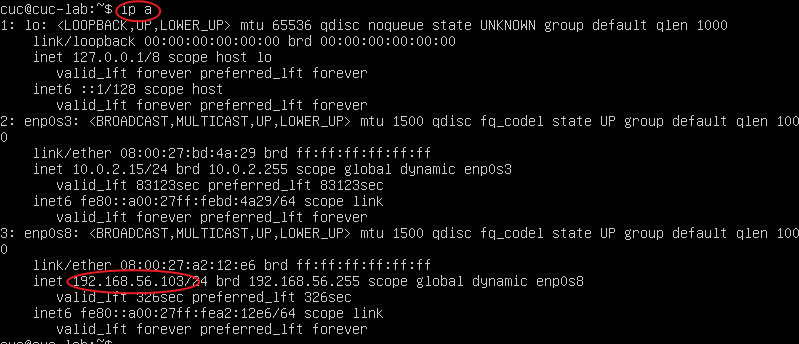

# 第一章：（实验）

## 实验目的

- 初步了解本地实验环境与阿里云实验环境的异同
- 了解查询当前所用Linux发行版本及内核版本的方法
- 了解如何通过`netplan`配置网卡信息
- 了解在虚拟机和宿主机之间、本机和远程 Linux 系统之间传输文件的方法
- 了解如何配置 SSH 免密登录

## 实验环境

- Ubuntu 20.04.02 Server 64bit
- 本地环境
  - Virtualbox 6.1.16
- [阿里云 云起实验室 提供的【零门槛云上实践平台】](https://developer.aliyun.com/adc/)
  - [Linux指令入门-文件与权限](https://developer.aliyun.com/adc/scenario/exp/a12055b0e9e84e5692b05ae25d377ec0)

## 实验过程

### 一、 调查并记录实验环境：
  - 当前 Linux 发行版基本信息

    ```shell
    cuc@cuc-lab:~$ lsb_release -a
    No LSB modules are available.
    Distributor ID: Ubuntu
    Description:    Ubuntu 20.04.2 LTS
    Release:        20.04
    Codename:       focal
    ```


  - 当前 Linux 内核版本信息

    ```shell
    cuc@cuc-lab:~$ cat /proc/version
    Linux version 5.4.0-107-generic (buildd@lcy02-amd64-058) (gcc version 9.4.0 (Ubuntu 9.4.0-1ubuntu1~20.04.1)) #121-Ubuntu SMP Thu Mar 24 16:04:27 UTC 2022
    
    cuc@cuc-lab:~$ uname -a
    Linux cuc-lab 5.4.0-107-generic #121-Ubuntu SMP Thu Mar 24 16:04:27 UTC 2022 x86_64 x86_64 x86_64 GNU/Linux
    ```


- 阿里云 云上 Linux 


### 二、 系统自启动实现+自动获取IP

**Virtual box 安装完 Ubuntu 之后新添加的网卡如何实现系统开机自动启用和自动获取 IP？**

#### 2.1 自启动

##### 2.1.1 查看系统自启动脚本

```shell
ls /lib/systemd/system
```

查看是否有`rc-local.service`这个文件


##### 2.1.2 修改该文件权限

```shell
sudo chmod 777 /lib/systemd/system/rc-local.service
```

##### 2.1.2 新增[Install]段

> [Unit] 段: 启动顺序与依赖关系
>
> [Service] 段: 启动行为，如何启动，启动类型
>
> [Install] 段: 定义如何安装这个配置文件，即怎样做到开机启动。

打开`rc-local.service`脚本，查看是否存在[Install] 段，无则添加：

```shell
[Install]
WantedBy=multi-user.target  
Alias=rc-local.service
```

```
$vi /lib/systemd/system/rc-local.service //打开文件
```

按ESC进入命令模式，输入A进入编辑
添加[Install] 段后再按ESC键，输入`：wq`保存并退出；再打开查看脚本内容是否被修改：


##### 2.1.3 编写`rc.local`文件

- 使用`nano`对文件进行修改：

```shell
sudo nano /etc/rc.local
```

- `rc.local`文件写入内容如下：

```shell
#!/bin/sh
echo "看到这行字，说明添加自启动脚本成功。" > /usr/local/test.log
exit 0
```


- 赋予权限

```shell
sudo chmod +x /etc/rc.local
```

- 在`/ect/systemd/system`目录下建立软连接：

```shell
sudo ln -s /lib/systemd/system/rc.local.service /etc/systemd/system/ 
```

- 重启Ubuntu即可实现自启动

#### 2.2 自动获取IP

- ubuntu以DHCP方式配置网卡自动获取IP。

- 输入以下命令编辑/etc/network/interfaces文件；

  ```shell
   sudo vi /etc/network/interfaces
  ```

- 编写以下内容：

  ```shell
  #The primary network interface - use DHCP to find our address
  auto eth0
  iface eth0 inet dhcp
  ```

### 三、 SCP文件传输

**如何使用 `scp` 在「虚拟机和宿主机之间」、「本机和远程 Linux 系统之间」传输文件？**

#### 3.1 虚拟机和宿主机之间

- 在虚拟机和宿主机分别建立共享文件夹`share`

  >新建文件：`touch filename`
  >
  >新建文件夹：`mkdir foldername`
  >
  >  (可同时创建多个文件夹：`mkdir foldername1 foldername2 foldername3`)

  ```shell
  mkdir share
  ```

- 将宿主机文件夹传输到虚拟机：

  >scp -r [宿主机文件夹路径] [虚拟机服务器用户名]@[地址]:[文件夹存放路径]
  >
  >```shell
  >scp -r /Desktop/share cuc@192.168.56.103:/home/share
  >```

- 将虚拟机文件夹传输到宿主机：

  >scp  -r  [虚拟机服务器用户名]@[地址]:[文件夹存放路径]  [宿主机文件夹路径]
  >
  >```shell
  >scp -r cuc@192.168.56.103:/home/share /Desktop/share
  >```

#### 3.2 本机和远程 Linux 系统之间

**远程Linux（服务器）传输到本机**

- 需要`ssh`登录远程Linux系统，才能进行文件传输操作

  - 远程Linux系统复制到本机
  
    > ssh [远程Linux系统用户名]@[服务器地址]
    >
    > scp -r [宿主机文件夹路径] [虚拟机服务器用户名]@[地址]:[文件夹存放路径]
    >
    > ```shell
    > ssh 
    > scp -r 
    > ```
  
  - 本机传输到远程Linux系统
  
    >ssh [远程Linux系统用户名]@[服务器地址]
    >
    >scp -r [宿主机文件夹路径] [虚拟机服务器用户名]@[地址]:[文件夹存放路径]
    >
    >```shell
    >ssh 
    >scp -r 
    >```

### 四、配置 SSH 免密登录

#### 4.1. 自己动手操作

##### 4.1.1 安装`ssh`软件

```shell
$ sudo apt-get install ssh
```


##### 4.1.2 加密设置

安装完成后进行加密设置

```shell
$ ssh-keygen -t rsa //ras为加密算法，还可以使用des算法
```

​	即可输入`ll .ssh`查询用户目录下的公私钥文件


##### 4.1.3 文件内容累加

使用`cat id_rsa>> authorized_keys`命令将`id_rsa`(私钥)文件中的内容累加写入到`~/.ssh/authorized_keys`文件中。


#### 4.2. 老师指导版（get bash)

##### 4.2.1 保证底层设置一致


##### 4.2.2 免密登录

- 首先进行在虚拟机中`ip a`查找IP地址



- 再在**CMD（或get bash）**中输入`ssh cuc@+IP地址`尝试免密登录

  因为我在课上已经跟着操作一遍，所以可以直接登录。


##### 4.2.3 免密登录配置

删除原有文件再重新操作：

（使用get bash 进行操作，因为`ssh-copy-id`在cmd中不可执行）

```shell
//依次输入
$ ssh-copy-id
$ which ssh-copy-id
//生成密钥长度
$ ssh-keygen -b 4096
//设置密钥算法为RSA算法
$ ls ~/.ssh/id_rsa
$ ls ~/.ssh/id_rsa.pub
$ ssh-copy-id -i ~/.ssh/id_rsa.pub cuc@192.168.56.103
//再次输入
$ ssh cuc@+ip地址
//即免密登录完成
//输入`exit`可退出登录状态
```


​	

## 参考资料：

[chap0x01-Aweiweiwe-GitHub](https://github.com/CUCCS/2022-linux-public-Aweiweiwe/tree/chap0x01/chap0x01)
