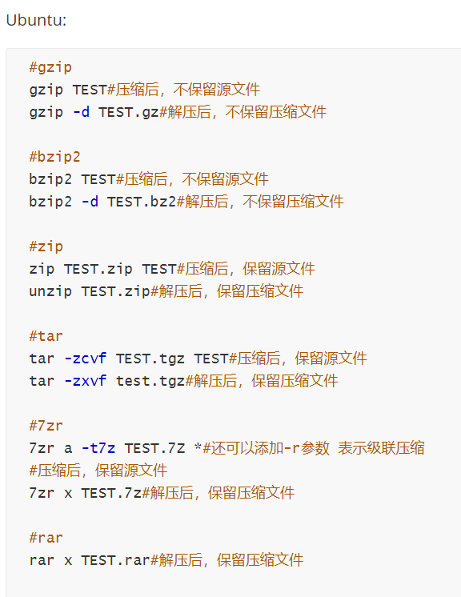

# 第二章：Linux命令行使用基础

## 实验目的

- 学会使用asciinema终端回放工具
- 了解软件包管理相关知识，并能熟练地安装或删除软件
- 了解文件管理
- 了解文件的压缩与解压缩
- 了解子进程的管理
- 学会获取硬件信息
- 对比本地环境和云环境中信息的获取方式

## 实验环境

- Ubuntu 20.04.02 Server 64bit
  - 本地环境
    - Virtualbox 6.1.16

- 阿里云平台 CentOS 7.7
  - [Linux指令入门-文件与权限](https://developer.aliyun.com/adc/scenario/exp/a12055b0e9e84e5692b05ae25d377ec0)
- 在 [asciinema](https://asciinema.org/) 注册一个账号，并在本地安装配置好asciinema

## 实验准备

**配置asciinema**

- ### Ubuntu 20.04.02

>1. 升级软件包；
>
>```shell
>sudo apt update
>```

>2. 安装`asciinema`；
>
>```shell
>sudo apt install asciinema
>```

>3. 将`asciinema`录制文件传到自己的账号上，复制连接并注册账号。
>
>```shell
>asciinema auth
>```
>
>4. `asciinema`录制操作：
>
>```shell
>asciinema rec <文件名.cast> #开始录制，并将记录命名为<文件名>
>asciinema upload <文件名.cast> #结束录制后要上传至asciinema.org
>```

### 阿里云平台 CentOS 7.7

>1. 数据库更新
>
>   ```shell
>   sudo yum makecache 
>   ```
>
>2. 安装`asciinema`
>
>   ```shell
>   sudo yum -y install asciinema 
>   ```

## 实验问题

使用表格方式记录至少 2 个不同 Linux 发行版本上以下信息的获取方法，使用 [asciinema](https://asciinema.org) 录屏方式「分段」记录相关信息的**获取过程和结果**

### 1【软件包管理】

- 在目标发行版上安装 `tmux` 和 `tshark` ；查看这 2 个软件被安装到哪些路径；

  - **Ubuntu 20.04.02**

    - tmux的安装和路径查看

    ```shell
    sudo apt install tmux #安装tmux
    sudo find / -name tmux #查看tmux安装路径
    ```

    具体步骤显示：

    [](https://asciinema.org/a/mGwxTwqaR67x4K8BQUdgWA1RD)

    - tshark的安装 & 安装路径查看 & 卸载和卸载结果查看

    ```shell
    sudo apt install tshark #安装tshark
    sudo find / -name tshark #查看tshark安装路径
    sudo apt purge tshark #tshark卸载
    ```

    具体展示：

    [](https://asciinema.org/a/wYJCgVappTb8syL4tZAz6Exsk)

  - **阿里云平台 CentOS 7.7**

    - `tmux`的安装和路径查看

    ```shell
    yum install tmux #安装tmux
    rpm -qal |grep tumx #查看tmux安装路径
    ```

    具体步骤显示：

    - `tshark`的安装 & 安装路径查看 & 卸载和卸载结果查看

    ```shell
    yum install wireshark 	#在CentOS中并没有tshark这个包，而是Wireshark包已经包含了tshark包，因此只需安装Wireshark即可
    yum -y remove wireshark #卸载
    ```
    
    具体展示：
    
    


### 2【文件管理】

复制以下 `shell` 代码到终端运行，在目标 Linux 发行版系统中构造测试数据集，然后回答以下问题：

```shell
cd /tmp && for i in $(seq 0 1024);do dir="test-$RANDOM";mkdir "$dir";echo "$RANDOM" > "$dir/$dir-$RANDOM";done
```

- 找到 `/tmp` 目录及其所有子目录下，**文件名**包含 `666` 的所有文件

- 找到 `/tmp` 目录及其所有子目录下，**文件内容**包含 `666` 的所有文件

  - **Ubuntu 20.04.02**

    - **文件名**包含 `666` 的文件

      ```shell
      sudo find ./ -type f -name "*666*" #文件名
  
    - **文件内容**包含 `666` 的文件
  
    	```shell
    	sudo grep -r "666" ./ --exclude=*.cast #文件内容
    	#通过"--exclude"排除 asciinema录制会在当前目录写入后缀为“.cast”文件而导致查找乱码的问题。
  
    具体展示：
  
    [](https://asciinema.org/a/1HhWsTjVnvcvG2x5v15ornqAP)
  
  - **阿里云平台 CentOS 7.7**
  
    - **文件名**包含 `666` 的文件
  
      ```shell
      find / -name '*666*' #文件名
      ```
  
    - **文件内容**包含 `666` 的文件
  
      ```shell
      find . | xargs grep -ri '666' # 文件内容
      ```
      
  
    具体展示：
  
    

### 3【文件压缩与解压缩】

- 练习课件中 [文件压缩与解压缩](https://c4pr1c3.github.io/LinuxSysAdmin/chap0x02.md.html#/12/1) 一节所有提到的压缩与解压缩命令的使用方法

  - **Ubuntu 20.04.02**

    - 将Windows主机上的test.zip文件拷贝到虚拟机上，并在虚拟机上查看文件是否已经成功上传

      ```shell
      scp ./Desktop/test.zip cuc@192.168.56.103:~/ #拷贝到虚拟机
      ls -l  #查看是否上传成功
      ```
  
      具体展示：
  
  - **阿里云平台 CentOS 7.7**




**文件夹操作要在文件夹名称前加上`-r`.**


### 4【跟练】

-  [子进程管理实验](https://asciinema.org/a/f3ux5ogwbxwo2q0wxxd0hmn54)

   - **Ubuntu 20.04.02**

     [](https://asciinema.org/a/AZwvKpzga72QQUGdjKCITpsxw)
   
   - **阿里云平台 CentOS 7.7**
   
     

### 5【硬件信息获取】

- 目标系统的 CPU、内存大小、硬盘数量与硬盘容量

  - **Ubuntu 20.04.02**

    ```shell
    grep "model name" /proc/cpuinfo |awk -F ':' '{print $NF}' #型号
    cat /proc/cpuinfo | grep "physical id" | uniq | wc -l #查看电脑处理器个数
    cat /proc/cpuinfo | grep "cpu cores" | uniq # 查看电脑处理器核数
    free -m #内存信息
    sudo fdisk -l |grep "Disk /dev/sd" # 硬盘数量和大小
    ```
  
    [](https://asciinema.org/a/JDT8Tzg3KL92TqmeAz3o0RQG4)
  
  - **阿里云平台 CentOS 7.7**
  
    ```shell
    cat /proc/cpuinfo | grep name | cut -f2 -d: | uniq -c # CentOS7查看CPU
    free -m # 查看内存情况
    df -hl # 查看磁盘剩余空间
    df -h # 查看每个根路径的分区大小
    ```


#### 总结Ubuntu和CentOs对以下信息的获取方式：

| 安装应用          | `apt install`                                                | `yum install -y`                                             |
| ----------------- | ------------------------------------------------------------ | ------------------------------------------------------------ |
| 卸载应用          | `sudo apt-get --purge remove tshark`                         | `yum remove`                                                 |
| 查看安装路径      | `dpkg -L tmux`                                               | `rpm -qal`                                                   |
| 查找文件名        | `sudo find / -name '*666*'`                                  | `find / -name '*666*'`                                       |
| 查找文件内容      | `sudo grep -r '666'./ --exclude=*.cast`                      | `find . | xargs grep -ri '666'`                              |
| zip压缩与解压缩   | `unzip filename.zip`解压文件  `zip filename`压缩文件         | `unzip filename.zip`解压文件  `zip filename.zip filename`压缩文件 |
| gzip压缩与解压缩  | `gzip -d filename.gz`解压文件  `gzip -d filename`压缩文件`   | `gzip -d filename.gz`解压文件  `gzip filename`压缩文件       |
| tar压缩与解压缩   | `tar -xvf filename.tar`解压文件  `tar -cvf filename`打包文件 | `tar -xvf filename.tar`解压文件  `tar -cvf filename.tar filename`打包文件 |
| bzip2压缩与解压缩 | `bzip2 -d filename.bz2` 解压文件  `bzip2 -z filename` 压缩文件 | `bzip2 -d filename.bz2` 解压文件  `bzip2 -z filename` 压缩文件｜ |
| 7z压缩与解压缩    | `7z x filename.7z` 解压文件  `7z a filename.7z` 压缩文件     | `7za x filename.7z` 解压文件  `7za a filename.7z` 压缩文件   |
| rar压缩与解压缩   | `rar a` 解压文件 `rar x`压缩文件                             | `rar a` 解压文件 `rar x`压缩文件                             |
| 硬件信息获取      | `cat /proc/cpuinfo`                                          | `cat /proc/meminfo`                                          |

## 参考资料

[asciinema的使用-CSDN](https://blog.csdn.net/weixin_30730151/article/details/99190378?ops_request_misc=%257B%2522request%255Fid%2522%253A%2522165690159416782184683961%2522%252C%2522scm%2522%253A%252220140713.130102334..%2522%257D&request_id=165690159416782184683961&biz_id=0&utm_medium=distribute.pc_search_result.none-task-blog-2~blog~sobaiduend~default-3-99190378-null-null.185^v2^control&utm_term=asciinema&spm=1018.2226.3001.4450)

[chap0x02-Aweiweiwe-GitHub](https://github.com/CUCCS/2022-linux-public-Aweiweiwe/tree/chap0x02/chap0x02)

